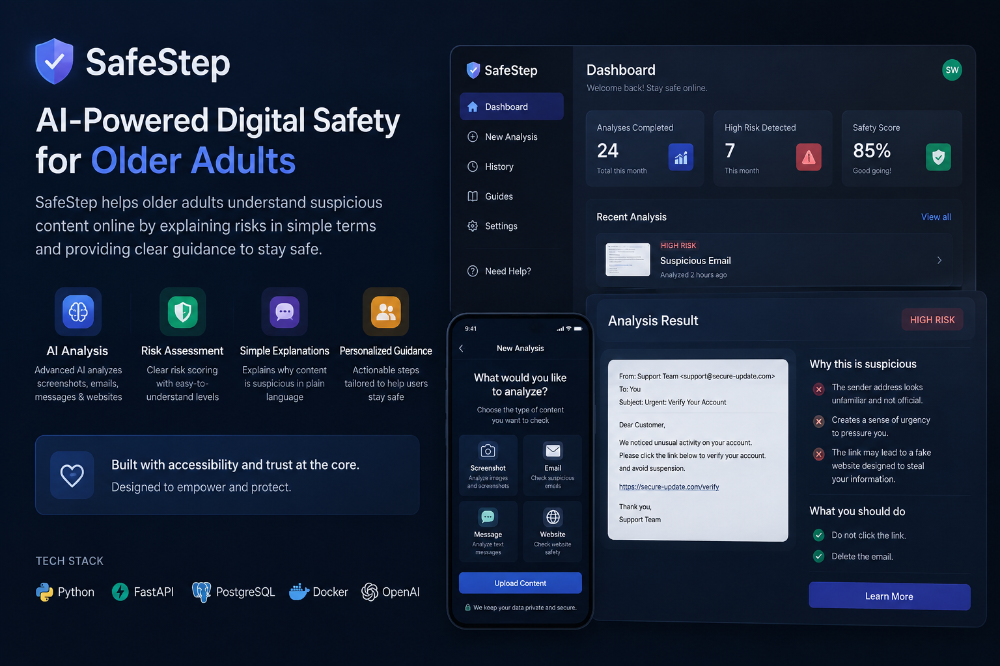
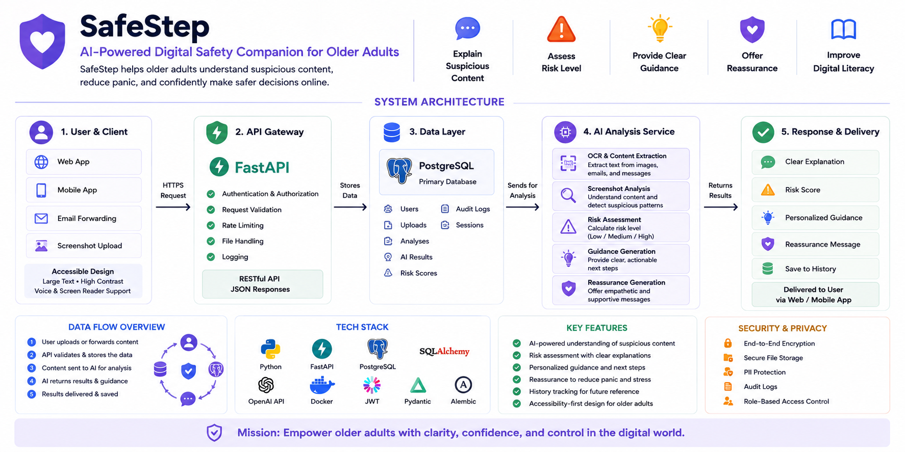
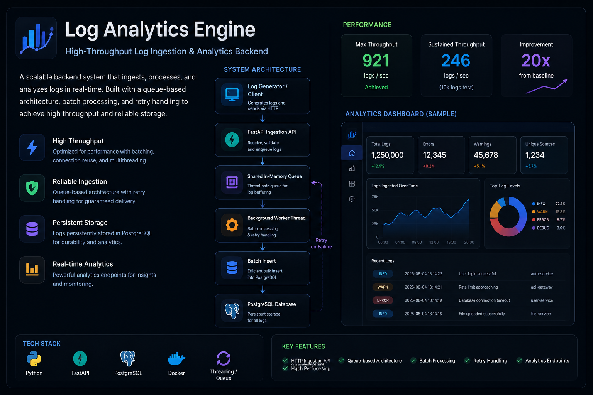

  

<h1 align="center">
Hi, I'm Sharif Waqas 👋
</h1>

Computer Science & Mathematics @ University of Southern Mississippi
 
Backend Engineering • Distributed Systems • AI Applications

Building reliable backend systems that prioritize performance, scalability, and maintainability.

---

# About

I'm a Computer Science & Mathematics student passionate about backend engineering and building software that solves real-world problems.

I enjoy designing systems that remain simple, reliable, and maintainable as they grow. Most of my work focuses on backend architecture, distributed systems, API development, databases, and AI-powered applications.

Currently preparing for **Summer 2027 Software Engineering internships** while building production-style backend projects.

---

# Featured Projects

## 🛡️ SafeStep

  

An AI-powered digital safety platform that helps older adults understand suspicious screenshots, emails, text messages, and websites.

Instead of simply labeling content as safe or dangerous, SafeStep explains **why** something appears suspicious, providing clear guidance while improving digital literacy.

### Highlights

- AI-powered screenshot analysis
- JWT authentication with secure refresh sessions
- Repository & Service Layer architecture
- Secure file upload pipeline
- PostgreSQL with SQLAlchemy ORM
- OpenAI Vision integration
- Risk scoring & personalized guidance
- Accessibility-first design

### Tech Stack

`Python`
`FastAPI`
`PostgreSQL`
`SQLAlchemy`
`Docker`
`OpenAI API`

### Project Architecture

### Why I Built It

SafeStep was inspired by the increasing number of online scams targeting older adults.

Rather than simply detecting scams, the platform focuses on helping users understand suspicious content, reduce panic, and confidently make safer decisions online.

➡️ **Repository**

https://github.com/SharifWaqas/safestep

---

## 📊 Log Analytics Engine

A production-style backend designed to ingest, process, and analyze high volumes of application logs using queue-based processing and background workers.

The project explores backend architecture patterns commonly used in modern distributed systems.

### Engineering Results

| Metric | Result |
|---------|--------|
| 🚀 Peak Throughput | **921.43 logs/sec** |
| ⚡ Performance Improvement | **~20×** |
| 📦 Deployment | Docker |
| 🧵 Processing | Queue + Background Workers |
| 🗄️ Database | PostgreSQL |
| 🌐 API | REST |

### Highlights

- Queue-based ingestion pipeline
- Background worker processing
- Batch database writes
- Retry handling
- Cursor pagination
- REST Analytics API
- Layered backend architecture
- Dockerized deployment

### Tech Stack

`Python`
`FastAPI`
`PostgreSQL`
`SQLAlchemy`
`Docker`
`Threading`

### Engineering Decisions

Instead of writing directly to PostgreSQL on every request, incoming logs are first placed into a shared queue where background workers process them in batches.

This architecture significantly reduced database overhead and improved throughput by nearly **20×** compared to the original implementation.

➡️ **Repository**

https://github.com/SharifWaqas/log-analytics-backend

---

# Engineering Philosophy

> Reliability before cleverness.

> Build simple systems that scale.

> Measure before optimizing.

> Design for maintainability.

> Learn by building.

---

# Technologies

### Languages

`Python`
`C++`
`SQL`

### Backend

`FastAPI`
`REST APIs`
`SQLAlchemy`
`JWT`
`Authentication`
`Repository Pattern`
`Service Layer`

### Databases

`PostgreSQL`

### AI

`OpenAI API`
`Prompt Engineering`
`Vision Models`

### Infrastructure

`Docker`
`Git`
`GitHub`

---

# Currently Learning

- Distributed Systems
- System Design
- Backend Scalability
- AI Infrastructure
- Performance Optimization

---

# Connect

📧 Email

**shaarif.1031@gmail.com**

💼 LinkedIn

**www.linkedin.com/in/muhammad-sharif-77494139b**

---

Thanks for visiting!

Always building.
Always learning.

