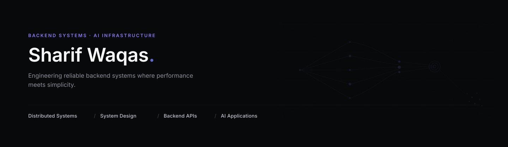

  

 

# Building software that scales.

Backend systems, distributed architecture, and AI-powered applications.

Currently building production-ready systems while pursuing Computer Science & Mathematics at the University of Southern Mississippi.# Building software that scales.

Backend systems, distributed architecture, and AI-powered applications.

Currently building production-ready systems while pursuing Computer Science & Mathematics at the University of Southern Mississippi.

## About

I enjoy building backend systems that solve real-world problems.

My interests lie at the intersection of backend engineering, distributed systems, and AI applications. I enjoy designing reliable APIs, scalable architectures, authentication systems, and intelligent software that remains maintainable as it grows.

Every project I build is an opportunity to improve both my engineering skills and my understanding of production software.

## Engineering Philosophy

I believe great software is built deliberately.

• Reliability before cleverness

• Simple systems scale

• Measure before optimizing

• Build for maintainability

• Learn continuously by building
